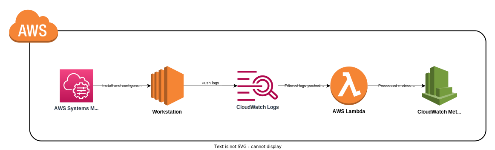
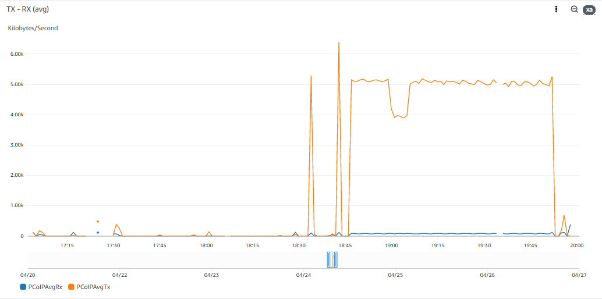
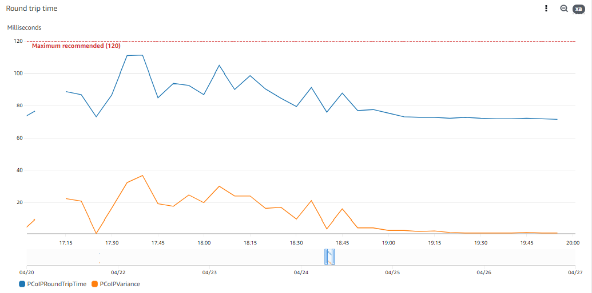
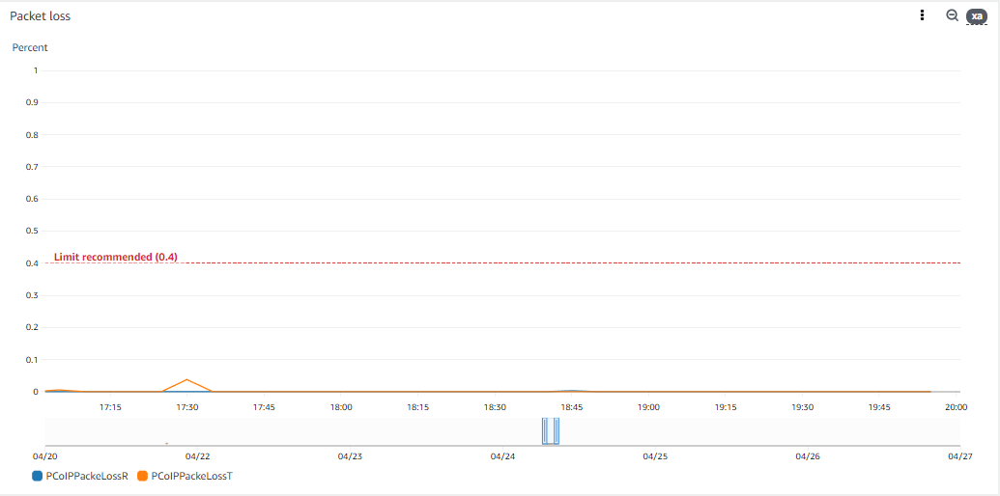

# PCoIP session metrics in AWS

[HP Anywhere](https://www.hp.com/us-en/solutions/digital-workspaces.html) is a product that allows companys to grant remote access to virtual workstations using the [PCoIP protocol](https://www.teradici.com/what-is-pcoip), which offers a secure, high-definition and highly responsive computing experience when working on a remote desktop that can be hosted both onprem or in the cloud.

When this solution is used in AWS, there are many infrastructure patterns that can be followed to implement it, like [this doc](https://www.teradici.com/web-help/pcoip/anyware-architecture-guide/2022.07/connection_models/connection-models) shows.

Once your infrastructure is ready and fully functional, your users are ready to connect to their workstations, and the support and troubleshooting phase starts. Even though HP offers some tools to get metrics of a PCoIP session, like the [PCoIP Session Statistics Viewer](https://docs.teradici.com/knowledge/pcoip-session-statistics-viewer), it can sometimes be challenging to pull those metrics.

In this post we will explore a possible solution to programatically push these metrics to AWS CloudWatch to empower your IT team to support your users.

## Approach

The EC2 instances used as workstations run a PCoIP agent (standard or graphic depending on the use case) that [periodically saves this information into log files](https://help.teradici.com/s/article/1395). The strategy we will be using is to configure the [AWS CloudWatch Agent](https://docs.aws.amazon.com/AmazonCloudWatch/latest/monitoring/Install-CloudWatch-Agent.html) in workstations with [AWS SSM](https://docs.aws.amazon.com/systems-manager/latest/userguide/what-is-systems-manager.html) to push this logs into CloudWatch Logs, apply a [CloudWatch Log Filter](https://docs.aws.amazon.com/AmazonCloudWatch/latest/logs/MonitoringLogData.html) to send specific log lines to be processed by an [AWS lambda](https://docs.aws.amazon.com/lambda/latest/dg/welcome.html) that will push the metrics to CloudWatch Metrics.



## Implementation

### CloudWatch Log group

We will first create a Log group in CloudWatch where all the data is going to be pushed:

**cloudwatch.tf**
```hcl
resource "aws_cloudwatch_log_group" "pcoip_logs" {
  name              = "pcoip"
  retention_in_days = 14
  tags              = var.tags
}
```

### CloudWatch agent configurations

The logs of the agent are located in **/var/log/pcoip-agent/** (Linux) or **C:\ProgramData\Teradici\PCoIPAgent\logs** (Windows), so we need to install and configure the CloudWatch agent to push logs from there. The cofigurations are templates that terraform will parse and save in AWS SSM parameters:

**cloudwatch/config_windows.json**
```json
{
    "logs": {
        "logs_collected": {
            "files": {
                "collect_list": [
                    {
                        "file_path": "C:\\ProgramData\\Teradici\\PCoIPAgent\\logs\\*Printing*",
                        "log_group_name": "${log_group}",
                        "log_stream_name": "{instance_id}-pcoip-printing-service",
                        "timestamp_format": "%Y-%m-%dT%H:%M:%S",
                        "timezone": "UTC"
                    },
                    {
                        "file_path": "C:\\ProgramData\\Teradici\\PCoIPAgent\\logs\\*pcoip_agent*",
                        "log_group_name": "${log_group}",
                        "log_stream_name": "{instance_id}-pcoip-agent",
                        "timestamp_format": "%Y-%m-%dT%H:%M:%S",
                        "timezone": "UTC"
                    },
                    {
                        "file_path": "C:\\ProgramData\\Teradici\\PCoIPAgent\\logs\\*pcoip_vhid*",
                        "log_group_name": "${log_group}",
                        "log_stream_name": "{instance_id}-pcoip-vhid",
                        "timestamp_format": "%Y-%m-%dT%H:%M:%S",
                        "timezone": "UTC"
                    },
                    {
                        "file_path": "C:\\ProgramData\\Teradici\\PCoIPAgent\\logs\\*pcoip_server*",
                        "log_group_name": "${log_group}",
                        "log_stream_name": "{instance_id}-pcoip-server",
                        "timestamp_format": "%Y-%m-%dT%H:%M:%S",
                        "timezone": "UTC"
                    }
                ]
            }
        },
        "log_stream_name": "default_log_stream"
    }
}
```

**cloudwatch/config_linux.json**
```json
{
    "logs": {
        "logs_collected": {
            "files": {
                "collect_list": [
                    {
                        "file_path": "/var/log/pcoip-agent/agent.log",
                        "log_group_name": "${log_group}",
                        "log_stream_name": "{instance_id}-pcoip-agent",
                        "timestamp_format": "%Y-%m-%dT%H:%M:%S",
                        "timezone": "UTC"
                    },
                    {
                        "file_path": "/var/log/pcoip-agent/session-launcher.log",
                        "log_group_name": "${log_group}",
                        "log_stream_name": "{instance_id}-pcoip-launcher",
                        "timestamp_format": "%Y-%m-%dT%H:%M:%S",
                        "timezone": "UTC"
                    }
                ]
            }
        },
        "log_stream_name": "default_log_stream"
    }
}
```

**ssm.tf**
```hcl
resource "aws_ssm_parameter" "cloudwatch_config_linux" {
  name = "/cw/workstations/linux"
  type = "String"
  tags = var.tags

  value = replace(templatefile("${path.module}/cloudwatch/config_linux.json", {
    log_group = aws_cloudwatch_log_group.pcoip_logs.name
  }), "/\n| /", "")
}

resource "aws_ssm_parameter" "cloudwatch_config_windows" {
  name = "/cw/workstations/windows"
  type = "String"
  tags = var.tags

  value = replace(templatefile("${path.module}/cloudwatch/config_windows.json", {
    log_group = aws_cloudwatch_log_group.pcoip_logs.name
  }), "/\n| /", "")
}
```

### Workstations provisioning

To install and configure automatically the CloudWatch agent in workstations, we will use AWS Systems Manager (AWS SSM). We will create an AWS SSM document and an association between this document and our workstations.

> It is important to have into account the [prerequisites](https://docs.aws.amazon.com/systems-manager/latest/userguide/systems-manager-setting-up-ec2.html) AWS SSM Agent has to work in an EC2 instance.
> 
> We will need to ensure SSM agent is running in our workstations (it is included in new AWS provided AMIs), connectivity between the instances and SSM service and a correct policy in the Instance profile that allows the agent to work.

**ssm/cloudwatch_agent_provisioning.yaml**
```yaml
schemaVersion: '2.2'
description: 'Install and run CW agent'
mainSteps:
- action: aws:configurePackage
  name: InstallCWAgent
  inputs:
    name: AmazonCloudWatchAgent
    action: Install
- action: aws:runDocument
  name: ConfigureCWAgentLinux
  precondition:
      StringEquals:
      - platformType
      - Linux
  inputs:
    documentType: SSMDocument
    documentPath: AmazonCloudWatch-ManageAgent
    documentParameters:
      action: configure
      optionalConfigurationSource: ssm
      optionalConfigurationLocation: "${linux_ssm_parameter}"
- action: aws:runDocument
  name: ConfigureCWAgentWindows
  precondition:
      StringEquals:
      - platformType
      - Windows
  inputs:
    documentType: SSMDocument
    documentPath: AmazonCloudWatch-ManageAgent
    documentParameters:
      action: configure
      optionalConfigurationSource: ssm
      optionalConfigurationLocation: "${windows_ssm_parameter}"
```

**ssm.tf**
```hcl
resource "aws_ssm_document" "cloudwatch_agent" {
  name            = "install-cloudwatch-agent"
  document_type   = "Command"
  document_format = "YAML"
  tags            = var.tags

  content = templatefile("${path.module}/ssm/cloudwatch_agent_provisioning.yaml", {
    linux_ssm_parameter   = aws_ssm_parameter.cloudwatch_config_linux.name
    windows_ssm_parameter = aws_ssm_parameter.cloudwatch_config_windows.name
  })
}

resource "aws_ssm_association" "cloudwatch_agent" {
  name             = aws_ssm_document.cloudwatch_agent.id
  association_name = "install-cloudwatch-agent-in-workstations"

  targets {
    key    = "tag:${var.workstation_tag.key}"
    values = [var.workstation_tag.value]
  }
}
```

### Filtering and parsing logs

Now that we have the workstations logs in CloudWatch Logs we can create a *log subscription filter* that will send specific logs of the log group to a lambda for processing:

**cloudwatch.tf**
```hcl
resource "aws_cloudwatch_log_subscription_filter" "pcoip_metrics" {
  depends_on = [aws_lambda_permission.allow_trigger_metrics_publisher]

  name            = "pcoip-metrics"
  log_group_name  = aws_cloudwatch_log_group.pcoip_logs.name
  filter_pattern  = "?MGMT_PCOIP_DATA ?VGMAC ?MGMT_IMG"
  destination_arn = module.metrics_publisher.lambda_function_arn
}

resource "aws_lambda_permission" "allow_trigger_metrics_publisher" {
  action        = "lambda:InvokeFunction"
  function_name = module.metrics_publisher.lambda_function_arn
  principal     = "logs.${data.aws_region.current.name}.amazonaws.com"
  source_arn    = "${aws_cloudwatch_log_group.pcoip_logs.arn}:*"
}
```

**lambda.tf**
```hcl
module "metrics_publisher" {
  source  = "terraform-aws-modules/lambda/aws"
  version = "4.2.0"

  function_name                     = "pcoip-metrics-publisher"
  description                       = "Lambda to process PCoIP logs and push metrics to CloudWatch"
  handler                           = "main.lambda_handler"
  runtime                           = "python3.8"
  source_path                       = "${path.module}/lambda/metrics_publisher"
  artifacts_dir                     = "${path.module}/builds"
  publish                           = true
  recreate_missing_package          = true
  ignore_source_code_hash           = true
  attach_policy_statements          = true
  cloudwatch_logs_retention_in_days = 14
  tags                              = var.tags

  policy_statements = {
    cloudwatch = {
      effect    = "Allow"
      actions   = ["cloudwatch:PutMetricData"]
      resources = ["*"]
    }
  }

  environment_variables = {
    metrics_namespace = var.metrics_namespace
  }
}
```

**lambda/metrics_publisher/main.py**
```py
import base64
import json
import zlib
import boto3
import re
import os
from datetime import datetime

NAMESPACE = os.environ.get("metrics_namespace")
cw_client = boto3.client("cloudwatch")

# Events based on https://help.teradici.com/s/article/1395
events_definitions = [
    {
        "event_pattern": ".*MGMT_PCOIP_DATA.*Tx thread info.*(?P<bw_group>bw limit\D*(?P<bw>[\d|\.]*))\W*(?P<avg_tx_group>avg tx\D*(?P<avg_tx>[\d|\.]*))\W*(?P<avg_rx_group>avg rx\D*(?P<avg_rx>[\d|\.]*)).*",
        "name": "Bandwidth metrics",
        "metrics": [
            {"Name": "PCoIPBandwidthLimit", "Unit": "Kilobytes/Second", "group": "bw"},
            {"Name": "PCoIPAvgTx", "Unit": "Kilobytes/Second", "group": "avg_tx"},
            {"Name": "PCoIPAvgRx", "Unit": "Kilobytes/Second", "group": "avg_rx"},
        ],
    },
    {
        "event_pattern": ".*MGMT_PCOIP_DATA.*Tx thread info.*(?P<rtt_group>round trip time\D*(?P<rtt>[\d|\.]*))\W*(?P<variance_group>variance\D*(?P<variance>[\d|\.]*))\W*(?P<rto_group>rto = (?P<rto>[\d|\.]*))\W*(?P<last_group>last\D*(?P<last>[\d|\.]*))\W*(?P<max_group>max\D*(?P<max>[\d|\.]*)).*",
        "name": "Latency metrics",
        "metrics": [
            {"Name": "PCoIPRoundTripTime", "Unit": "Milliseconds", "group": "rtt"},
            {"Name": "PCoIPVariance", "Unit": "Milliseconds", "group": "variance"},
        ],
    },
    {
        "event_pattern": ".*VGMAC.*Stat frms\W*(?P<R>R\D*(?P<r_a>[\d|\.]*)/(?P<r_i>[\d|\.]*)/(?P<r_o>[\d|\.]*))\W*(?P<T>T\D*(?P<t_a>[\d|\.]*)/(?P<t_i>[\d|\.]*)/(?P<t_o>[\d|\.]*)).*(?P<loss>Loss\D*(?P<r_loss>[\d|\.]*)%/(?P<t_loss>[\d|\.]*)%).*",
        "name": "Packet loss metrics",
        "metrics": [
            {"Name": "PCoIPPackeLossR", "Unit": "Percent", "group": "r_loss"},
            {"Name": "PCoIPPackeLossT", "Unit": "Percent", "group": "t_loss"},
        ],
    },
    {
        "event_pattern": ".*MGMT_PCOIP_DATA.*ubs-BW-decr\W*(?P<decrease_loss_group>Decrease\D*(?P<decrease_loss>[\d|\.]*))\W*(?P<current_group>current\D*(?P<current>[\d|\.]*))\W*(?P<active_group>active\D*(?P<active_from>[\d|\.]*)\D*(?P<active_to>[\d|\.]*))\W*(?P<adjust_factor_group>adjust factor\D*(?P<adjust_factor>[\d|\.]*)%)\W*(?P<floor_group>floor\D*(?P<floor>[\d|\.]*))\W*",
        "name": "Floor metrics",
        "metrics": [],
    },
    {
        "event_pattern": ".*MGMT_IMG.*log \(SoftIPC\).*(?P<tbl_group>tbl\W*(?P<tbl>[\d|\.]*))\W*(?P<fps_group>fps\W*(?P<fps>[\d|\.]*))\W*(?P<q_group>quality\W*(?P<quality>[\d|\.]*)).*",
        "name": "Image metrics",
        "metrics": [
            {"Name": "PCoIPQuality", "Unit": "Percent", "group": "quality"},
            {"Name": "PCoIPFPS", "Unit": "Count", "group": "fps"},
            {"Name": "PCoIPTBL", "Unit": "Count", "group": "tbl"},
        ],
    },
    {
        "event_pattern": ".*MGMT_IMG.*log \(SoftIPC\).*(?P<group1>bits\/pixel\W*(?P<bits_pixel>[\d|\.]*))\W*(?P<group2>bits\/sec\W*(?P<bits_sec>[\d|\.]*))\W*(?P<group3>MPix\/sec\W*(?P<mpix_sec>[\d|\.]*)).*",
        "name": "Image metrics",
        "metrics": [
            {"Name": "PCoIPBitsPerPixel", "Unit": "Count", "group": "bits_pixel"},
            {"Name": "PCoIPBitsPerSec", "Unit": "Count", "group": "bits_sec"},
            {"Name": "PCoIPMpixPerSec", "Unit": "Count", "group": "mpix_sec"},
        ],
    },
]


def decode_event(event):
    decoded_event = base64.b64decode(event)
    decoded_event = zlib.decompress(decoded_event, 16 + zlib.MAX_WBITS).decode("utf-8")
    decoded_event = json.loads(decoded_event)

    return decoded_event


def convert_to_number(x):
    try:
        return int(x)
    except:
        return float(x)


def handle_event(event, instance_id, match, timestamp):
    # Get instance name from instance id
    for metric in event["metrics"]:

        cw_client.put_metric_data(
            Namespace=NAMESPACE,
            MetricData=[
                {
                    "MetricName": metric["Name"],
                    "Dimensions": [
                        {"Name": "InstanceId", "Value": instance_id},
                    ],
                    "Value": convert_to_number(match.group(metric["group"])),
                    "Unit": metric["Unit"],
                    "Timestamp": timestamp,
                },
            ],
        )


def lambda_handler(event, context):
    # Decode message sent by CloudWatch
    decoded_event = decode_event(event["awslogs"]["data"])
    print(decoded_event)

    # Get relevant data
    log_stream = decoded_event["logStream"]
    log_events = decoded_event["logEvents"]
    instance_id = re.search("i-[a-zA-Z0-9]{17}", log_stream).group(0)

    # Iterate over all messages
    for log_event in log_events:
        message = log_event["message"]
        timestamp = datetime.utcfromtimestamp(
            int(log_event["timestamp"]) / 1000
        ).strftime("%Y-%m-%dT%H:%M:%S.%fZ")

        # Iterate over messages patterns
        for event_definition in events_definitions:

            # Find a match with any of the regex definitions
            match = re.search(event_definition["event_pattern"], message)
            if match:
                print(
                    "Event matched!",
                    {"event_type": event_definition["name"], "message": message},
                )

                # Push metric
                handle_event(event_definition, instance_id, match, timestamp)
                break
```

## Results

These are some metrics extracted from a workstation running an active PCoIP session:

### TX and RX



### Round trip time



### Packet loss



## TL;DR

PCoIP sessions metrics can be programatically pushed from workstations' PCoIP agent logs using AWS Systems Manager, AWS CloudWatch and AWS Lambda.

AWS Systems Manager is used to install and configure the CloudWatch agent in the workstations; and to store cloudwatch configurations in AWS SSM parameters.

AWS CloudWatch agent is used to push logs from workstations to AWS CloudWatch logs; AWS CloudWatch Log Subscription is used to filter logs and execute a processing lambda; AWS CloudWatch Metrics is used to store the results.

AWS Lambda is used to process filtered logs from AWS CloudWatch Logs and extract metrics from there.

## Reference

The code presented in this post is available as a terraform module in https://github.com/SixNines/hp-anywhere-session-metrics

You can deploy it in your account using:

```hcl
module "pcoip_metrics" {
  source = "git@github.com:SixNines/hp-anywhere-session-metrics"

  metrics_namespace = "pcoip"
  
  workstation_tag = {
    key   = "type"
    value = "workstation"
  }
}
```
